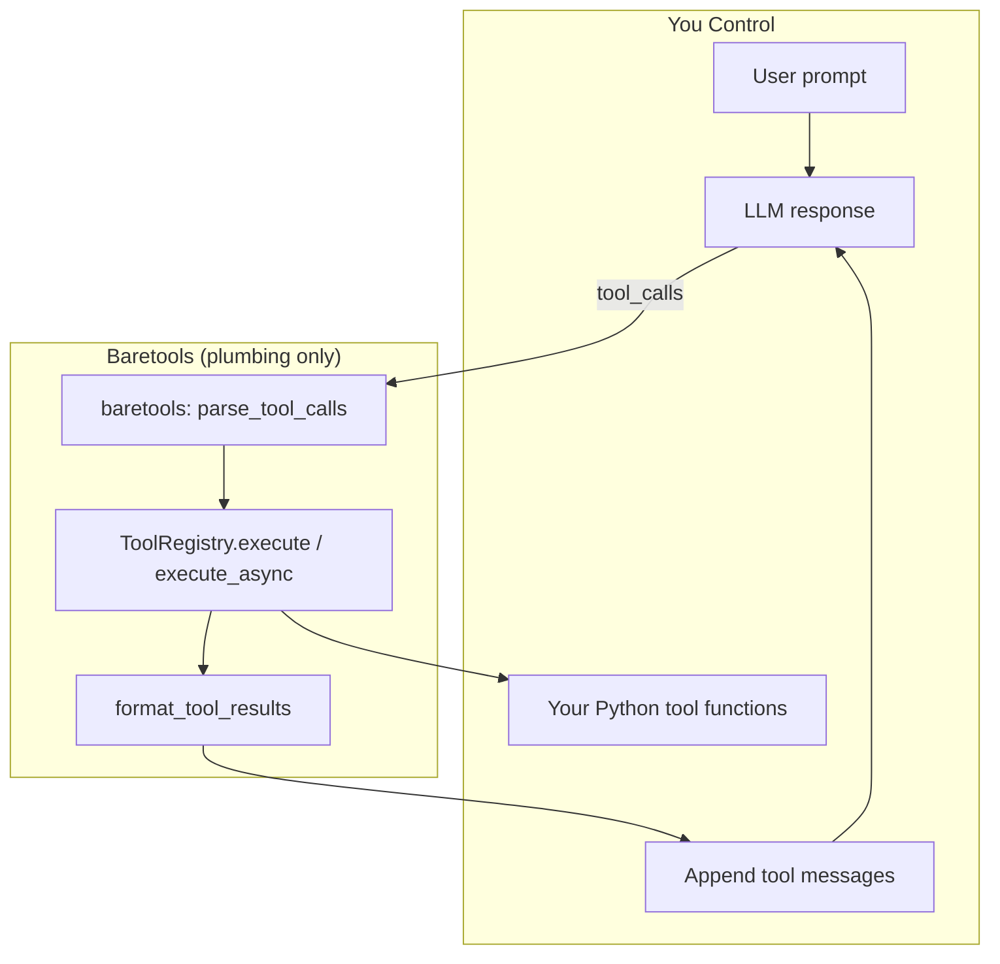

# [WIP] Baretools AI

**The un-framework for AI Agents**

Just the plumbing. You bring the intelligence.

---

## The Problem

Modern agent frameworks try to do too much:

- **Opinionated orchestration** that doesn't fit your use case
- **Black-box prompt management** hiding your most important logic
- **Over-abstracted context handling** fighting you at every turn
- **Rigid execution flows** that assume one-size-fits-all
- **Cognitive overhead** learning framework patterns instead of building

You end up fighting the framework more than building your application.

**The truth**: With modern LLMs, your prompts *are* your application logic. You need full control over context, orchestration, and state management. These vary wildly by use case and shouldn't be abstracted away.

---

## The Solution

Baretools AI does **one thing well**: handle the boring, error-prone plumbing between your Python functions and LLM tool calls.

**What Baretools provides:**
- Function → LLM tool schema conversion
- Tool call parsing and validation
- Function execution routing
- Result formatting back to LLM format

**What you control:**
- Your prompts and system messages
- Context window engineering
- Orchestration logic (retries, loops, conditionals)
- State management
- Error handling and guardrails

No magic. No opinions. No fighting the framework.

---

## Visual Overview



Baretools handles schema conversion + tool execution mechanics, while you keep full control over prompts, orchestration loops, retries policy, and state management.

---

## Technical Specification

### Core Components

#### 1. Tool Registration
```python
@tool
def search_web(query: str, max_results: int = 5) -> str:
    """Search the web for information."""
    # Your implementation
    pass
```

**Capabilities:**
- Automatic schema generation from type hints and docstrings
- Support for Pydantic models as parameters
- Optional manual schema override
- Validation of function signatures

#### 2. Schema Generation
```python
tools = ToolRegistry()
tools.register(search_web)

# Get LLM-compatible schema
schemas = tools.get_schemas("openai")  # or anthropic/json_schema
gemini_tools = tools.get_schemas("gemini")  # [{"functionDeclarations": [...]}]
```

**Output formats:**
- OpenAI function calling format
- Anthropic tool use format
- Gemini function declaration format
- Generic JSON schema

#### 3. Tool Execution
```python
# Parse LLM response
tool_calls = parse_tool_calls(llm_response)

# Execute tools
results = tools.execute(tool_calls)

# Format for next LLM call
formatted_results = format_tool_results(results)
```

**Features:**
- Parallel execution support
- Error capture without crashing
- Execution metadata (timing, success/failure)
- Type validation on inputs

#### 4. Result Handling
```python
{
    "tool_call_id": "call_abc123",
    "output": "Search results...",
    "error": None,
    "execution_time_ms": 234
}
```

---

## Roadmap

### ✅ Phase 1: Core (v0.1.0)
- [x] Tool decorator and registration
- [x] Schema generation (OpenAI format)
- [x] Basic tool execution
- [x] Error handling

### 🎯 Phase 2: Multi-Provider (v0.2.0)
- [x] Anthropic format support
- [x] Google/Gemini format support
- [x] Provider-agnostic schema conversion

### 🔮 Phase 3: Developer Experience (v0.3.0)
- [x] Async tool execution
- [x] Built-in logging/tracing hooks
- [x] Pydantic model support
- [x] Streaming tool results
- [x] Concrete provider examples and documentation

### 💡 Phase 4: Advanced (v0.4.0)
- [ ] Tool composition (tools calling tools, tool search, programmatic tool calls)
- [ ] Execution sandboxing options
- [ ] Cost tracking utilities
- [ ] Rate limiting helpers

---


## CI

GitHub Actions now uses `uv` to run `ruff check .` and `pytest -q` on pushes and pull requests targeting `main`.

---

## Current Implementation Status

This repository now includes a minimal `v0.1.0` implementation in `src/baretools` with:
- `@tool` decorator metadata
- `ToolRegistry.register()` schema generation
- `ToolRegistry.execute()` with optional parallel execution
- `parse_tool_calls()` and `format_tool_results()` helpers

Run locally:
```bash
uv sync --group dev
uv run pytest -q
```

---

## Installation

```bash
pip install baretools-ai
```

---

## Quick Start

```python
from baretools import tool, ToolRegistry
from openai import OpenAI

# 1. Define your tools
@tool
def get_weather(location: str) -> str:
    """Get current weather for a location."""
    # Your implementation
    return f"Sunny, 72°F in {location}"

@tool
def calculate(expression: str) -> float:
    """Evaluate a mathematical expression."""
    return eval(expression)  # In production, use safe eval!

# 2. Register tools
tools = ToolRegistry()
tools.register(get_weather)
tools.register(calculate)

# 3. Use with your LLM (you control everything)
client = OpenAI()
messages = [{"role": "user", "content": "What's the weather in Paris?"}]

while True:
    response = client.chat.completions.create(
        model="gpt-4",
        messages=messages,
        tools=tools.get_schemas()  # ← Baretools helps here
    )

    message = response.choices[0].message

    # No tool calls? We're done
    if not message.tool_calls:
        print(message.content)
        break

    # Execute tools
    results = tools.execute(message.tool_calls)  # ← Baretools helps here

    # YOU decide how to handle results
    messages.append(message)
    messages.append({
        "role": "tool",
        "tool_call_id": results[0]["tool_call_id"],
        "content": results[0]["output"]
    })
```

---

## Usage Examples

### Custom Orchestration
```python
# You control the loop, retries, and logic
max_iterations = 5
for i in range(max_iterations):
    response = llm.chat(messages, tools=tools.get_schemas())

    if not response.tool_calls:
        break

    results = tools.execute(response.tool_calls)

    # Your custom logic
    if any(r["error"] for r in results):
        # Handle errors your way
        messages.append({"role": "user", "content": "That failed, try differently"})
    else:
        # Success - add results
        for result in results:
            messages.append(format_tool_result(result))
```

### Async Tools
```python
@tool
async def fetch_customer(customer_id: str) -> dict:
    return await api_client.get_customer(customer_id)

# Works in sync loops
sync_results = tools.execute(tool_calls)

# Works in async loops
async_results = await tools.execute_async(tool_calls, parallel=True, retries=1)
```

### Parallel Calls, Logging, and Retries
```python
import logging
from baretools import ToolRegistry

events = []
registry = ToolRegistry(logger=logging.getLogger("baretools"), on_event=events.append)

results = registry.execute(
    tool_calls,
    parallel=True,
    max_workers=8,
    retries=2,
    retry_delay_seconds=0.2,
)
```

`results` includes `attempts` metadata for each call, and `on_event` receives structured tool execution events (attempt/retry/failure).

### Parallel Execution
```python
# Baretools executes in parallel by default
tool_calls = [
    {"name": "search_web", "arguments": {"query": "AI news"}},
    {"name": "search_web", "arguments": {"query": "Python tips"}},
    {"name": "get_weather", "arguments": {"location": "NYC"}}
]

results = tools.execute(tool_calls, parallel=True)
```

### Error Handling
```python
results = tools.execute(tool_calls)

for result in results:
    if result["error"]:
        print(f"Tool {result['tool_name']} failed: {result['error']}")
        # You decide: retry? skip? fail? continue?
    else:
        print(f"Success: {result['output']}")
```

### Pydantic Model Parameters
```python
from pydantic import BaseModel

class Address(BaseModel):
    street: str
    city: str
    zip: str

@tool
def create_user(name: str, address: Address) -> dict:
    return {"name": name, "city": address.city}

tools = ToolRegistry()
tools.register(create_user)

# The address parameter is described as a JSON object in the schema,
# and dict arguments from the LLM are validated into an Address instance
# before create_user runs.
results = tools.execute([{
    "id": "c1",
    "name": "create_user",
    "arguments": {
        "name": "Ada",
        "address": {"street": "1 Infinite Loop", "city": "Cupertino", "zip": "95014"},
    },
}])
```

`pydantic` is an optional dependency \u2014 only required if a tool actually
declares a `BaseModel` parameter.

### Streaming Results as They Complete
```python
# Sync: yields ToolResult per call. With parallel=True, yields in completion order.
for result in tools.execute_stream(tool_calls, parallel=True, max_workers=4):
    handle(result)

# Async equivalent
async for result in tools.execute_stream_async(tool_calls, parallel=True, max_concurrency=4):
    await handle(result)
```

### Provider Agent Loops

Live, runnable provider examples now live in `examples/`:

- `examples/openai_agent.py` shows OpenAI Chat Completions tool calling with `tools.get_schemas("openai", strict=True)`, `parse_tool_calls()`, and `ToolRegistry.execute()`.
- `examples/anthropic_agent.py` shows Claude `tool_use` / `tool_result` handling with `tools.get_schemas("anthropic")`.
- `examples/gemini_agent.py` shows Gemini `function_call` / `from_function_response` handling with `tools.get_schemas("gemini")`.

Each script uses the same three BMI tools to show the same pattern across providers:

1. The model receives plain user text.
2. Baretools provides the provider-specific schema shape.
3. The provider emits one or more tool calls.
4. Baretools executes those calls, optionally in parallel.
5. The tool outputs are fed back to the model for the next turn or final answer.

Run them with real provider SDKs and API keys:

```bash
pip install openai anthropic google-genai
OPENAI_API_KEY=... uv run python examples/openai_agent.py
ANTHROPIC_API_KEY=... uv run python examples/anthropic_agent.py
GOOGLE_API_KEY=... uv run python examples/gemini_agent.py
```

Optional Weights & Biases tracing is supported in all three examples:

```bash
pip install weave wandb
WANDB_API_KEY=... WEAVE_PROJECT=baretools-ai-examples \
    OPENAI_API_KEY=... uv run python examples/openai_agent.py
```

When `WEAVE_PROJECT` is set, each example traces the agent loop and each baretools
tool execution. OpenAI and Anthropic SDK calls are also auto-traced by Weave,
so developers can inspect both the model turns and the tool spans in W&B.

---

## Philosophy

**We believe:**
- Developers should control their prompts, not frameworks
- Context engineering is application-specific
- Orchestration logic belongs in your code
- Less abstraction = more clarity
- The best framework is one you barely notice

**We don't:**
- Manage your conversation state
- Decide when to call tools
- Handle your retries or error recovery
- Abstract away the LLM interaction
- Try to be "smart" on your behalf

---

## Contributing

Baretools AI is intentionally minimal. Before proposing features, ask:
- Does this belong in every tool-calling application?
- Can developers easily implement this themselves?
- Does this add opinions about orchestration or prompting?

If the answer to any is "no," it probably doesn't belong in Baretools.

---

## License

MIT

---

## Why "Baretools"?

**Bare** (adj): without addition or embellishment; simple and basic.

That's us. 🛠️
